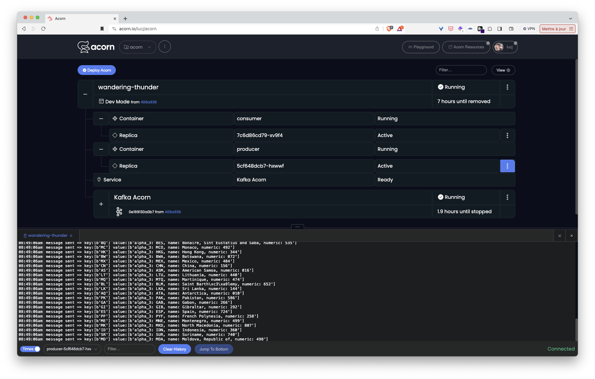
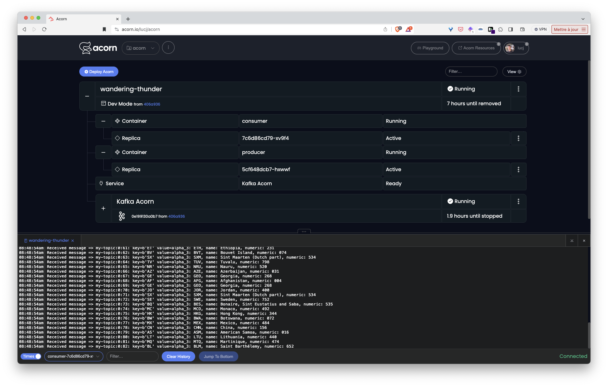

## What is Kafka ?

Kafka is a distributed event streaming platform which provides a highly scalable, fault-tolerant, and publish-subscribe system. It is designed for handling real-time data feeds and processing large-scale data streams.

Kafka is commonly used for building real-time data pipelines and streaming applications. It allows producers to publish messages to topics, and consumers to subscribe to those topics. It is often employed in scenarios such as log aggregation, data integration, and event-driven architectures.

## Kafka as an Acorn Service

The Acornfile used to create a Kafka based Acorn Service is available in the GitHub repository at [https://github.com/acorn-io/kafka](https://github.com/acorn-io/kafka). This service triggers the creation of a Kafka message brocker running in a single container which can easily be used by an application during development.

This Kafka instance defines a default topic which can be used by an application to produce and consume messages.

The Acorn image of this service is hosted in GitHub container registry at [ghcr.io/acorn-io/kafka](ghcr.io/acorn-io/kafka)

## Usage

The [examples folder](https://github.com/acorn-io/kafka/tree/main/examples) contains a sample application using this Service.

This app consists of 2 Python containers:
- the first one produce a message every second. Each message has a key containing a random country code and a value containing country details 
- the second one is a consumer of those messages

In the example Acornfile  we first define a *service* property:

```
services: kafka: {
	if args.dev {
		build: {
			context:   "../"
			acornfile: "../Acornfile"
		}
	} else {
		image: "ghcr.io/acorn-io/kafka:v#.#.#-#"
	}
}
```

Next we define the application containers. Theses ones connect to the Kafka service via environment variables which values are set based on the service's properties.

```
containers: {

	consumer: {
		build: {
			context: "consumer"
		}
		consumes: ["kafka"]
		env: {
			KAFKA_HOST: "@{service.kafka.address}"
			KAFKA_PORT: "@{service.kafka.port.9092}"
			KAFKA_TOPIC: "@{service.kafka.data.topicName}"
		}
		memory: 128Mi
	}

	producer: {
		build: {
			context: "producer"
		}
		consumes: ["kafka"]
		env: {
			KAFKA_HOST: "@{service.kafka.address}"
			KAFKA_PORT: "@{service.kafka.port.9092}"
			KAFKA_TOPIC: "@{service.kafka.data.topicName}"
		}
		memory: 128Mi
	}
}
```

These containers are respectively built using the Dockerfiles from the *examples/producer* and *example/consumer* folders. Once built, they can communicate with the Kafka service using the address and credentials provided via the dedicated variables.

This example can be run with the following command (to be run from the *examples* folder)

```
acorn run -n app
```

When run in Acorn Sandbox we can see Kafka service, producer and consumer are created. We can then get the producer and consumer logs from the UI:





Note: access to the sandbox requires only a GitHub account, which is used for authentication.

[](https://acorn.io/run/ghcr.io/acorn-io/kafka/examples:v%23.%23.%23-%23)

An application running in the Sandbox will automatically shut down after 2 hours, but you can use the Acorn Pro plan to remove the time limit and gain additional functionalities.